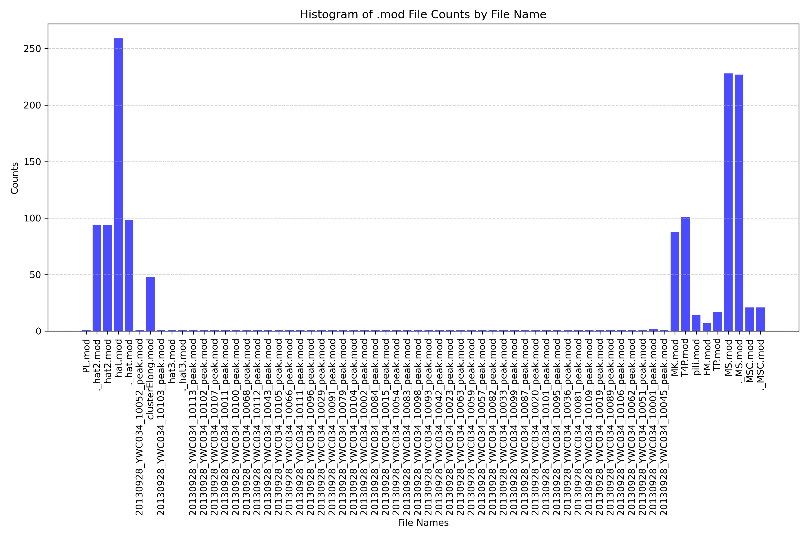

### Updateing the CryoET Data Portal

This `tutoral` is meant for one of the undergrads on the ImageAI team.

## CryoET Data Portal
This [database](https://cryoetdataportal.czscience.com/) is hosted by CZI and is partialy(?) developed by Utz Ermel. The majority of the images hosted on this database has been provided by Grant Jensen. Unfortunatly, non of these tomograms have annotations. We are taking it upon ourselvs to add as many labels as we can to this data. These annotations are going to come from ourselfs and from passed annotations.

Currently CZI has all of the data on hand, although at the time of writing, only about 10,000 are availible at the moment. Grant believes this might be due to the fact that CZI wants the database to be made up of not only grants data.

## Mohammed Kaplan Home Drive (source of about 1000+ hand annotations)
Mohammed was a post doc of Grant Jensen and hand labeled a lot of data. This data is availible on the BYU supercomputer. There are 4 group storage directories [grp_tomo_db1_d1, grp_tomo_db1_d2, grp_tomo_db1_d3, grp_tomo_db1_d3] representing the 4 drives given to us by mohammed. These are split up because of a 20TB max in the compute subdirectory of these directories. The compute directory is not backed up, all other directories are on the supercomputer. The data is organized "typically" by species -> 


Here are some general things to know about this data:

.mrc files typically are raw tilt series images
.rec files are 3d reconstructions of the tilt series. Most likley using IMOD. different algorithms can be used to do this reconstruction. More details in Vocabulary.
.mod files contain information about the .rec or .mrc including annotations.

Common Functions:
imodinfo -a <path/to/.mod/> (prints out some metadata of mrc file, including annotations in the form of a slicerangle)
header <path to mrc> metadata of mrc(different from .mod) not including annotations

PEET directories contain subtomogram averages of specific objects. The
differnet run denote updates to the template used for the averaging. Each run
updates the template for a better averaging.

Vocabulary:
MS - MS ring
C(sometimes included with MS like MSC) - C ring
P(can be combined with other) - P ring
rod - rod
peak Ignore these. They are not labels
fm - Full Motor
cluster* refers to fidutials automatic allignment(ignore)

## Viewing Tomograms

If you ever want to view these tomograms you have three options:
1. Download them onto your local machine. Look into the `scp` command
2. Use the supercomputer [remote desktop](https://rc.byu.edu/wiki/?id=Remote+Desktop) to view on a GUI(this is quite laggy)
3. use X forwarding to tell the supercomputer to use your machines display(see [view_tomogram_via_tomogram.md]())

## Methods of updataing data
I think the best way to send the data to CZI is by batches of objects. To explain what I mean lets look at some visuals from grp_tomo_db1_d1. 

### Finding Overlapping tomograms between Mohammed and CZI
To find the overlapping tomograms, first Eben used the cryoET data portal to get a list of all of the run names.
You can do this by running the following:
```
from cryoet_data_portal import Client, Run
client = Client()
all_runs = Run.find(client)
```
Once he had this list he searched through all of the directory names to see if any of them were on this list. This might be a good time to mention that for grants data on the data portal runs are "Metadata for an experiment run" i am not completely sure what this means, but for us a run is one time someone took pictures from the electron microscope and this is represented as a directory typically in the format of someones initials followed by a date. i.e mka2019-05-25-10

[here](https://github.com/byu-biophysics/ImageAI/blob/main/czi_metadata/data_exploration_scripts/search_subdirs.py) is the script that Eben used to do the matching.

### Visualizing obejects in overlap
For each of the drives we want to visualize over all of our shared runs the amout of .mod file aka labels we have. Here is that visualization of Drive 1

We see here that we have a hat, hat2, MK, T4P, Pili, FM, TP, MS, and MSC see
[this](https://docs.google.com/spreadsheets/d/1ZpPu6gx_Kr3D95Wj2k2k-nTb4cevR5amsESNbmEY8io/edit?usp=sharing)
google sheet to find what some of these mean. This sheet needs to be updataed
some more. 

### Saving .mod files with run as name and sending Metadata
Now all that is left is to get a list of the .mod files rename them to
include the run so that whoever is adding this at CZI can update correctly.
Scripts to do this can be found in [czi_metadata/data_exploration_scripts](https://github.com/byu-biophysics/ImageAI/tree/main/czi_metadat)

## Passed common Files
Once we felt like they have the majority of the metadata for the overlapped tomograms we can move on to things they have not yet uploaded. The order in which we should do this is largest -> smallest simililarly going it in batches of objects/species.  

## Passed Mohammad data
- Przemek T4SS [files](https://drive.google.com/file/d/1X4RVIaj-OICEC66XNSnzY4UL9XyaULHH/view)


## IMPORTANT! List of currently submitted batches
[Here]() is a shared drive where we can keep track of what has been submitted.

### Quick list
- Drive 3 MS ring. 
